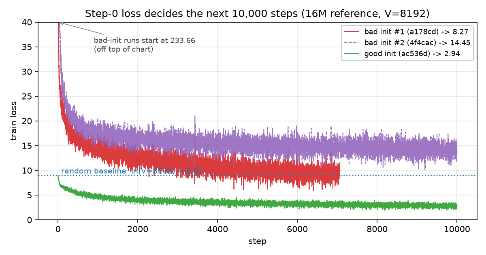

# Init and the random baseline: why step-0 loss should be ln(V)

The third entry in the FLM build log. Yesterday was about memory. Today is
about a single diagnostic number — **the loss before any training happens** —
and what it tells you about parameter initialization. We wasted two full
training runs learning this.

## Goal

> Train a real **16M-parameter** language model, end to end, with a workflow
> that is reproducible, observable, and easy to extend.

### Task board

- [x] Model architectures in `flm-llm`: ReferenceModel, DSTiny, DeepSeekV4
- [x] Neural building blocks + AdamW optimizer in `flm-modules`
- [x] Dataset loading, incl. CalcQA, in `flm-datasets`
- [x] RL trainers (PPO, GRPO) in `flm-rl`
- [x] Config-driven training: YAML configs, module split, configs-by-kind, local secrets
- [x] Reusable trainer engine and pluggable sinks (files, TensorBoard, MLflow, W&B)
- [x] Memory-efficient loss backends: torch linear cross-entropy, TileLang CCE, Cut Cross-Entropy
- [ ] (current) Training-stability init: tied-embedding scale so loss starts at ln(V)
- [ ] Evaluation harness (measured benchmarks, not just train loss)
- [ ] Checkpointing + resume mid-run
- [ ] Real / larger dataset support beyond the repo-source preset

---

The cheapest sanity check on a language model is the loss at step 0, before a
single gradient step. It should be `ln(V)`. Two of our runs started at **233**
instead. Here is why that happens, and what it cost.

## The ln(V) sanity check

Cross-entropy for predicting one of `V` tokens has a simple shape:

- **Lower bound 0** — a perfect model that puts all probability on the right
  token.
- **The uniform / random baseline is `ln(V)`** — a model that knows nothing
  and predicts `1/V` for every token scores
  `CE = −log(1/V) = log(V) = ln(V)`. For our `repo_8192` tokenizer, `V = 8192`
  and `ln(V) = 9.01`.
- **Unbounded above** — there is no ceiling.

A freshly-initialized model has learned nothing, so its honest prediction is
"I don't know" — the uniform distribution. **Step-0 loss ≈ ln(V) is healthy.**
Step-0 loss ≫ ln(V) is a red flag: the model is not ignorant, it is
*confidently wrong*. It concentrates probability on the wrong tokens, and
`−log(p_correct)` shoots toward infinity as `p_correct → 0`. Cross-entropy
does not politely stop at the random line; it can sail far past it.

So before reading any later number, read step 0.

## What we saw

Three `16m_repo_reference` runs, same `V = 8192`, same data, same 10,000-step
budget:

| run | step-0 loss | step 1000 | final | verdict |
| --- | --- | --- | --- | --- |
| `a178cd` | **233.66** | 14.3 | 8.27 (7k steps) | bad init — barely reaches the baseline |
| `4f4cac` | **233.66** | 17.6 | **14.45** | bad init — ends *worse than random* |
| `ac536d` | **9.01** | 4.3 | 2.94 | good init — starts on ln(V), trains cleanly |

The two bad-init runs start ~25× above the baseline — so far off the chart
that the plot clips them. One limps back down to the random line by step
~7000, having learned essentially nothing for seven thousand steps. The other
never even reaches the baseline: it plateaus at 14.45, comfortably worse than
a coin flip, after the full 10k budget. The good run starts exactly on
`ln(V) = 9.01` and descends smoothly to 2.94.

## Why init spiked to 233

The `ReferenceModel` **ties its weights**: `lm_head.weight =
token_embedding.weight`. That one shared matrix is *both* the input embedding
*and* the output classifier. PyTorch's default `nn.Embedding` init is
`N(0, 1)` per element — fine for an embedding, catastrophic as a classifier.

The math is direct. With the hidden state `h` and a classifier row `w` both
entrywise `~N(0, 1)` over `d_model = 256`, the logit `h·w` has mean `0` and
variance `d_model`, i.e. standard deviation `√d_model ≈ 16`. A softmax over
8192 logits with standard deviation 16 is, for all practical purposes, a
one-hot on some random token: supremely confident, almost always wrong. With
`p_correct ≈ 0`, `CE = −log(p_correct)` explodes. We measured **233.66**.

The fix (commit `194b807`): initialize the tied matrix small,
`uniform(−1/d_model, 1/d_model)`. Now each entry is on the order of `±1/256`,
the logit `h·w` has standard deviation roughly `1/√d_model ≈ 0.06`, and the
softmax over near-equal logits is ≈ uniform. Cross-entropy collapses to
`ln(V) = 9.01` — exactly what the good run measured at step 0. A test pins the
invariant: `loss < ln(V) + 1` at initialization.

## Why only the embedding needs touching

PyTorch ships every submodule with a sensible default through
`reset_parameters()`, and FLM relies on it for everything *except* the tied
embedding:

- **`nn.Linear`** (attention projections, the SwiGLU FFN, and an untied
  `lm_head`) uses Kaiming uniform with `a = √5`, weight bound `1/√fan_in`,
  bias bound `1/√fan_in`. This is the variance-preserving choice — it keeps
  activation and gradient variance roughly constant from layer to layer,
  which is exactly what you want under residual connections. Nothing to tune.
- **`nn.Embedding`** defaults to `N(0, 1)` per element. As a pure *input*
  embedding that is fine: a token vector has expected squared norm `√d`, on
  the same order as the rest of the activations. The trouble appears *only*
  when this matrix is also pressed into service as the output classifier via
  tying — our case.
- **RMSNorm** initializes its weight to `1` with no bias. At init the block is
  "normalize, then scale by identity" — it preserves scale and adds nothing
  to tune.

So the hidden path of the network is self-initializing. The one matrix whose
init scale is *load-bearing* is the shared embedding/classifier, because the
same numbers must serve two roles with conflicting scale needs. As an input
embedding, `O(1)` entries give token vectors useful spread; as a classifier,
the dot-product logits need to be `O(1/√d)` so the softmax starts uniform.
Tying forces a compromise, and `N(0, 1)` takes the embedding's side — which
is what detonates the logits. The `uniform(±1/d)` fix takes the classifier's
side: small enough that the softmax is uniform at init (loss = `ln(V)`),
while still harmless as an embedding because the network is
normalization-heavy and the embeddings grow quickly under gradient.

## The real cost

The frightening number is not the 233 spike — it is run `4f4cac`. Same data,
same budget, same architecture as the good run; the *only* difference is the
embedding init scale. After 10,000 steps it sat at **14.45**, still above the
random line. Bad init does not merely cost you the first few hundred steps of
climbing down from 233; it can strand the optimizer in a basin it never
escapes, leaving the model permanently worse than guessing. Two complete runs
wasted, before a one-line fix.

## Open question: why the bad run stalls at the baseline

Here is the genuinely puzzling part. Run `a178cd` *does* climb down from 233
to roughly 9 — the very loss the good run *starts* at. Yet from there it
barely improves (8.27 at step 7k), while the good run, starting at the same
9, sails down to 2.94. Same loss value, very different futures. Why? This is
open — we have not isolated it — but three candidate explanations:

1. **Same loss ≠ same parameters.** `ln(V)` only certifies that the output
   distribution is ≈ uniform. It says nothing about *which* parameter
   configuration produced that uniformity. The good init reaches uniform via
   small, well-scaled weights; the bad init reaches it only after dragging
   the saturated `N(0,1)` classifier back down over thousands of steps,
   landing in a different — and apparently worse — basin. Loss is a sufficient
   statistic for current predictive quality, not for trainability from here.
2. **Optimizer-state pollution.** AdamW carries running first/second-moment
   estimates of the gradient. During the 233→9 climb those gradients were
   enormous and wildly varying, so the moment estimates are inflated and slow
   to decay. For many steps after reaching 9 the effective per-parameter step
   size is mis-scaled — the optimizer is still paying off the early spike.
   A fresh good-init run starts with clean, small moments from step 1.
3. **Tied-weight coupling.** Because the embedding and classifier are the
   same matrix, the giant early gradients that repair the softmax *also*
   distort the input representations. By the time the output is uniform, the
   token embeddings have been pulled into a shape dictated by "fix the
   saturated classifier," not "be good features" — and the rest of the
   network, trained against those distorted embeddings, is correspondingly
   off.

We do not yet know which dominates. The clean experiment is available: take
the bad-init checkpoint at the step it first hits `ln(V)`, reset the
optimizer state, and resume. If it then descends like the good run,
optimizer-state pollution is the culprit; if it still stalls, the parameter
basin is. That is a natural follow-up; for now it stays an open question.

## Why it mattered

Initialization is the one thing that happens *before* training, and it sets
the floor for everything after. Getting step-0 loss onto `ln(V)` is free — it
is a constant, not a hyperparameter to tune — and it turned a run stuck at
14.45 into a clean descent to 2.94. The lesson is now encoded as a test: read
step 0, and if it is not `ln(V)`, stop and fix the init before burning another
run.

## References

[1] O. Press and L. Wolf. *Using the Output Embedding to Improve Language
    Models.* [arXiv:1608.05859](https://arxiv.org/abs/1608.05859), 2016 —
    weight tying, the coupling that makes the embedding init scale act on the
    classifier too.

[2] O. F. Inan and R. Khosravi. *Tying Word Vectors and Word Classifiers.*
    [arXiv:1611.01462](https://arxiv.org/abs/1611.01462), 2016 — shared
    embedding / softmax weights.

[3] A. Karpathy. *A Recipe for Training Neural Networks.* 2019.
    <https://karpathy.github.io/2019/04/25/recipe/> — the "check that init
    loss ≈ ln(vocab)" sanity check.

[4] FLM. *Tied-embedding init at small scale.* Commit `194b807`,
    `packages/llm/src/flm_llm/model.py` + `packages/llm/tests/test_reference_model.py`,
    this repository.
